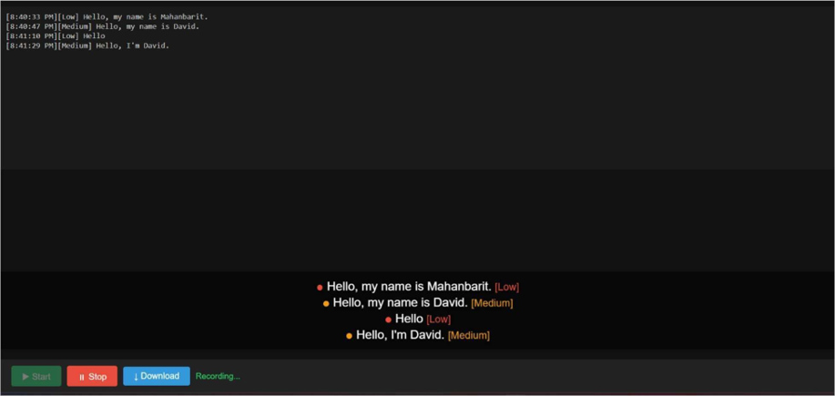

# Real-Time Speech to Text Subtitle Generation

A browser-based web app that turns live microphone speech into on-screen subtitles in real time. It runs **fully offline** on an ordinary laptop CPU: no cloud APIs, no GPU, no per-use cost, and no audio leaves the machine.

B.Tech Final Year Project, Manipal University Jaipur (CSE, AI & ML), 2026.



*The confidence indicator marks each subtitle as High (green), Medium (orange) or Low (red), so uncertain lines are easy to spot.*

## Features

- Live microphone capture in the browser and real-time subtitle overlay
- Offline speech recognition using Whisper (small model) via `faster-whisper`
- Colour-coded confidence indicator for each subtitle (green / orange / red), based on Whisper's log-probability scores
- Timestamped session transcript with one-click plain-text download
- Temporary audio files are deleted immediately after processing

## How it works

1. The browser records the microphone in 3-second chunks (HTML5 MediaRecorder API).
2. Each chunk is sent to the Python server over a WebSocket (Flask-SocketIO).
3. `ffmpeg` converts the audio to 16 kHz, 16-bit mono WAV.
4. `faster-whisper` transcribes the chunk and returns text plus a confidence score.
5. The server sends the result back and the browser shows it as a subtitle.

## Tech stack

Python, Flask, Flask-SocketIO, Eventlet, faster-whisper (Whisper small, CTranslate2), ffmpeg, JavaScript, HTML/CSS

## Setup

Developed and tested on Windows 11 with Python 3.14 and Google Chrome.

```bash
# 1. Install ffmpeg (Windows)
winget install ffmpeg
# Ubuntu: sudo apt install ffmpeg      macOS: brew install ffmpeg

# 2. Install Python dependencies
pip install -r requirements.txt

# 3. Start the server (the Whisper model, about 500 MB, downloads on first run)
python app.py
```

Then open **http://localhost:5000** in Chrome, click **Start**, allow microphone access, and speak.

The model size can be changed in a `.env` file (see `.env.example`): `tiny`, `base`, `small`, `medium` or `large`.

## Choosing the speech engine

The project originally used Vosk. I tested four configurations on my own speech before switching to Whisper:

| Stage | Setup | Chunk | Observation | Decision |
|---|---|---|---|---|
| 1 | Vosk `en-in-0.4` | 2 s | Very poor; basic words misrecognised | Abandoned |
| 2 | Vosk `en-in-0.5` | 2 s | Slight improvement; sentences still poor | Abandoned |
| 3 | Vosk `en-in-0.5` | 3 s | Marginal gain from longer context | Abandoned |
| 4 | Vosk `en-us-0.22` (~1.8 GB) | 3 s | Better, roughly 15-20% word error rate (informal estimate) | Abandoned |
| 5 | faster-whisper `small` | 3 s | Full sentences, names and technical terms transcribed correctly | **Adopted** |

The original Vosk version is kept in `app_vosk.py` for comparison.

## Measured performance

Intel Core i5 (12th gen), 8 GB RAM, CPU only, Windows 11, Chrome.

| Metric | Result |
|---|---|
| End-to-end subtitle latency | 3-5 seconds |
| ffmpeg conversion | 80-200 ms per chunk |
| Whisper transcription | 1.5-3 s per chunk |
| RAM during transcription | ~350 MB |
| CPU utilisation | 30-50% |

## Tests

```bash
python -m pytest test_app.py -v
```

Nine unit tests check the audio-format validation rules and the structure of the result. They use a stand-in transcription function, so they run without loading the Whisper model.

## Limitations and future work

- Single user and single speaker, English only, quiet environment
- 3-5 second delay, mostly from the 3-second chunk window
- Ideas: streaming/VAD-based transcription, SRT subtitle export, multilingual support, speaker labels, LAN deployment for classrooms

## Acknowledgements

Built with [faster-whisper](https://github.com/SYSTRAN/faster-whisper), [Whisper](https://github.com/openai/whisper), [Vosk](https://github.com/alphacep/vosk-api), [Flask-SocketIO](https://github.com/miguelgrinberg/flask-socketio) and [FFmpeg](https://ffmpeg.org).
